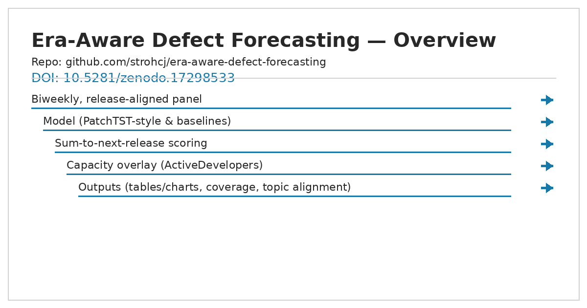

# Era-Aware Defect Forecasting (Research Teaser)

## Overview

<picture>
  <source media="(prefers-color-scheme: dark)" srcset="docs/overview_clean_dark.png">
  
</picture>

<sub>Prefer dark? See the image directly: [docs/overview_clean_dark.png](docs/overview_clean_dark.png)</sub>

[](https://orcid.org/0009-0002-9787-0266) <br> [](https://github.com/strohcj)
<br> [](https://www.linkedin.com/in/cynthia-stroh/)


https://zenodo.org/badge/DOI/10.5281/zenodo.17298533.svg

Repository: https://github.com/strohcj/era-aware-defect-forecasting

This repository shares **methodology, evaluation harness, and synthetic data** for an
**era-aware, biweekly, release-aligned forecasting pipeline** that couples **defect totals**
with **active developer capacity** and compares semantic **topic persistence** across eras.

> ⚠️ This repo is a *teaser*: it includes **synthetic data**, a **sum-to-release evaluator**,
> and a **topic-centroid alignment demo**. It deliberately omits private pre-processing
> and full training code to reduce "copy & transplant" risk. For collaboration inquiries,
> please open an issue.

## Highlights
- **ReleaseWindowID alignment** for biweekly panels
- **Sum-to-next-release** evaluation
- **Capacity coupling** via ActiveDevelopers
- **High↔Low era topic alignment** using centroid cosine

## What’s included
- `data/synthetic/` – synthetic biweekly panel + topic docinfo with the **same schema** as our pipeline.
- `src/eval_sum_to_release.py` – reference evaluation (MAE/MAPE/WAPE) on the panel.
- `src/topic_alignment_demo.py` – centroid cosine demo with synthetic embeddings.
- `src/synthetic_data.py` – generator to reproduce the toy dataset.
- `MODEL_CARD.md` – scope, risks, limitations.
- `SCHEMA.md` – required columns and formats.

## Quickstart
```bash

## Quickstart

[](https://colab.research.google.com/github/strohcj/era-aware-defect-forecasting/blob/main/notebooks/Colab_Quickstart.ipynb)

# Python 3.10–3.12 recommended
python -m venv .venv && source .venv/bin/activate  # (Windows: .venv\Scripts\activate)
pip install -r requirements-minimal.txt
python -m src.synthetic_data --out data/synthetic
python -m src.eval_sum_to_release --panel data/synthetic/biweekly_panel.csv
python -m src.topic_alignment_demo --docinfo data/synthetic/docinfo_combined.csv --out results
from src.eval_sum_to_release import evaluate_sum_to_release
panel_csv = "data/synthetic/biweekly_panel.csv"
out = evaluate_sum_to_release(panel_csv, metrics=["MAE","MAPE","WAPE"])
print(out.head())
```

## License
This repository is released under a **source-available** license (BUSL-1.1). Non-commercial
academic use is permitted; commercial use requires separate permission. See `LICENSE`.
Non-commercial academic use permitted; commercial use requires permission (see LICENSE).

## Citation
See `CITATION.cff`.

## Cite

**APA**
Stroh, C. (2025). *Era-Aware Defect Forecasting (Research Teaser)* [Software]. Zenodo. https://doi.org/10.5281/zenodo.17298533

**BibTeX**
```bibtex
@software{stroh_era_aware_defect_forecasting_2025,
  author  = {Stroh, Cynthia},
  title   = {Era-Aware Defect Forecasting (Research Teaser)},
  year    = {2025},
  version = {v0.1.0},
  doi     = {10.5281/zenodo.17298533},
  url     = {https://doi.org/10.5281/zenodo.17298533},
  note    = {Synthetic, source-available}
}
